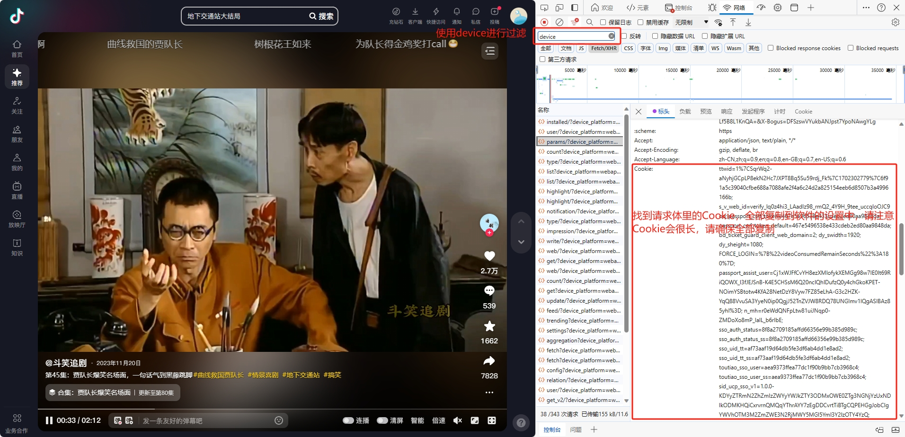
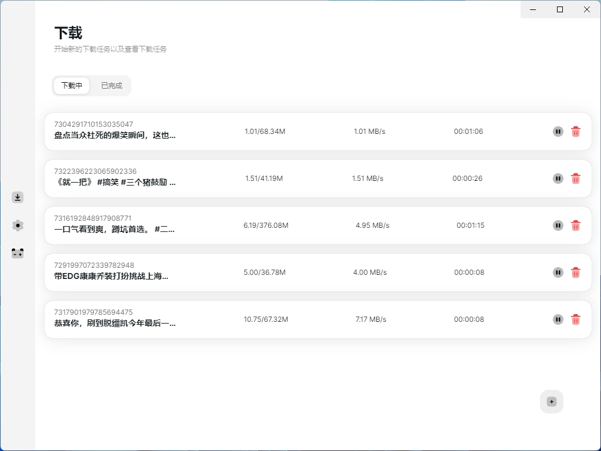

# DouyinDownloader

一款跨平台的抖音下载器GUI，支持抖音无水印视频批量下载，基于Electron和React开发。

## 👋🏻 快速开始

请注意，DouyinDownloader目前正在积极开发中，遇到任何问题欢迎反馈及提交Issue。

## ✨ 功能

#### `1` 抖音无水印视频批量下载

DouyinDownloader 现在支持通过简单的GUI交互下载抖音无水印视频。

|                              链接形式                              | 是否支持 |
| :----------------------------------------------------------------: | :------: |
|    https://www.douyin.com/discover?modal_id=7317901979785694475    |    ✅    |
| https://www.douyin.com/user/xxxxxxxxx?modal_id=7286026282956000575 |    ✅    |

> \[!Note]
>
> 此功能正在开发中，请确保您已阅读源代码以了解如何使用。

> \[!TIP]
>
> |     功能     | 全局快捷键 |
> | :----------: | :--------: |
> | 新建链接下载 | `CTRL + N` |

##### 设置 Cookie

> \[!IMPORTANT]
>
> 在下载前请保证正确设置了 Cookie，否则将无法正确的解析资源。



##### 截图




## ⚡️ 开发

```bash
$ git clone this repo
$ cd the repo
$ pnpm install
$ pnpm dev -w
```

## 🛠 构建(WIP)

> \[!IMPORTANT]
>
> 现阶段未对任何平台的分发进行测试，请使用开发模式进行调试。

```bash
$ git clone this repo
$ cd the repo
$ pnpm install

# For windows
$ pnpm build:win

# For macOS
$ pnpm build:mac

# For Linux
$ pnpm build:linux

```

## ⚠️ Disclaimers

> \[!IMPORTANT]
>
> 在使用本项目的代码和功能之前，请您认真考虑并接受以上免责声明。如果您对上述声明有任何疑问或不同意，请不要使用本项目的代码和功能。如果您使用了本项目的代码和功能，则视为您已完全理解并接受上述免责声明，并自愿承担使用本项目的一切风险和后果。

- 使用者对本项目的使用由使用者自行决定，并自行承担风险。作者对使用者使用本项目所产生的任何损失、责任、或风险概不负责。
- 本项目的作者提供的代码和功能是基于现有知识和技术的开发成果。作者尽力确保代码的正确性和安全性，但不保证代码完全没有错误或缺陷。
- 使用者在任何情况下均不得将本项目的作者、贡献者或其他相关方与使用者的使用行为联系起来，或要求其对使用者使用本项目所产生的任何损失或损害负责。
- 用者在使用本项目的代码和功能时，必须自行研究相关法律法规，并确保其使用行为合法合规。任何因违反法律法规而导致的法律责任和风险，均由使用者自行承担。
- 基于本项目进行的任何二次开发、修改或编译的程序与原创作者无关，原创作者不承担与二次开发行为或其结果相关的任何责任，使用者应自行对因二次开发可能带来的各种情况负全部责任。

## 📃 License

MIT © [ppxb](./LICENSE)
